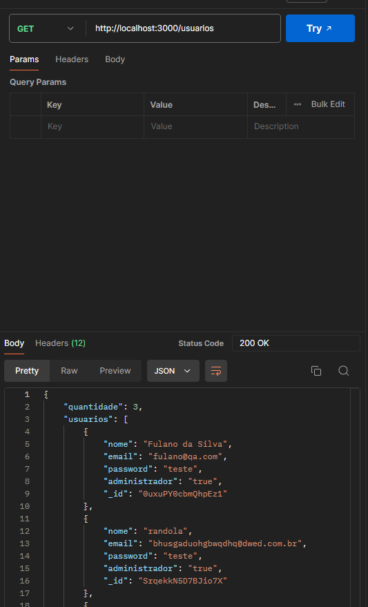
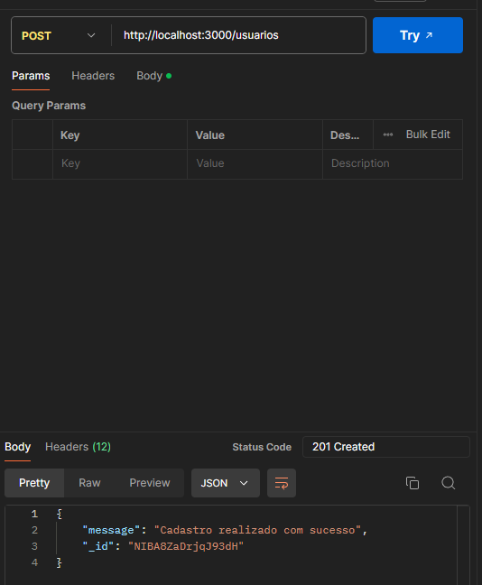
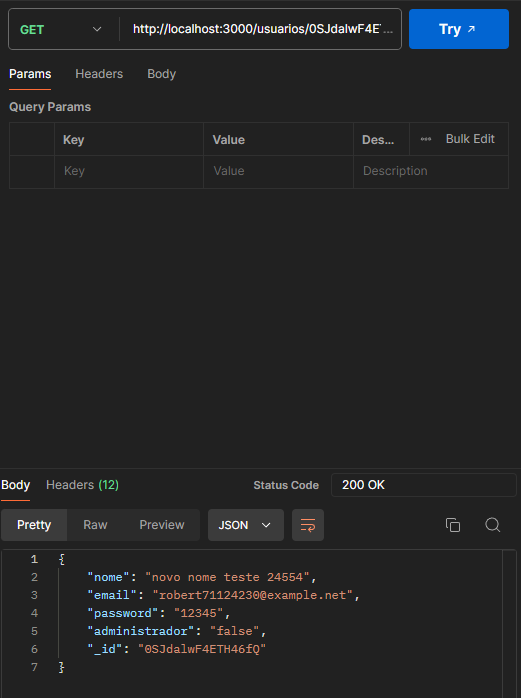
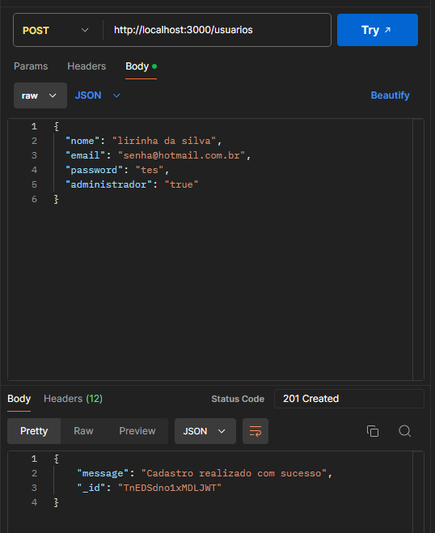
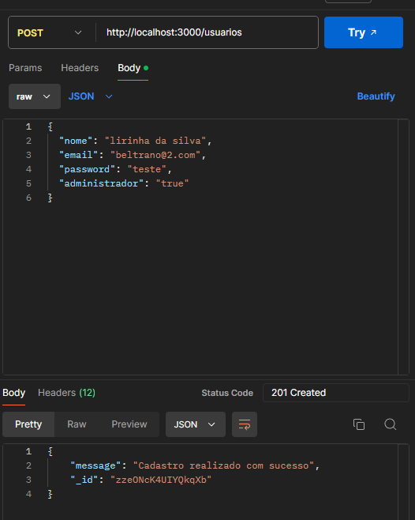
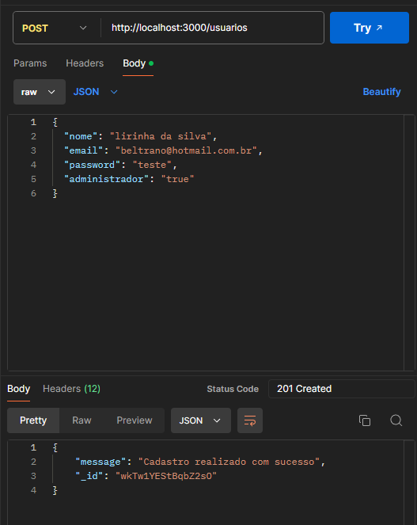

# Exercicio dia 8

- 1) Crie uma requisição Get para validar o retorno de usuários através da API;

- 2) Crie uma requisição Post para cadastrar um novo usuário através da API;

- 3) Crie uma requisição Get para validar o retorno de um usuário apenas através da API (pode utilizar os IDs dos usuários que vocês irão criar);

- 4) Crie cenários alternativos no cadastro de usuários, explore possíveis erros que podem ocorrer e mapeie as requisições através do Postman;

- 5) Crie cenários alternativos na atualização de usuários, explore possíveis erros que podem ocorrer e mapeie as requisições através do Postman;

- 6) Crie cenários alternativos na exclusão de usuários, explore possíveis erros que podem ocorrer e mapeie as requisições através do Postman. 
